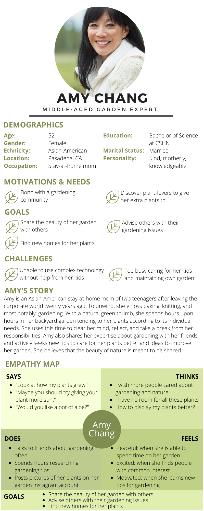
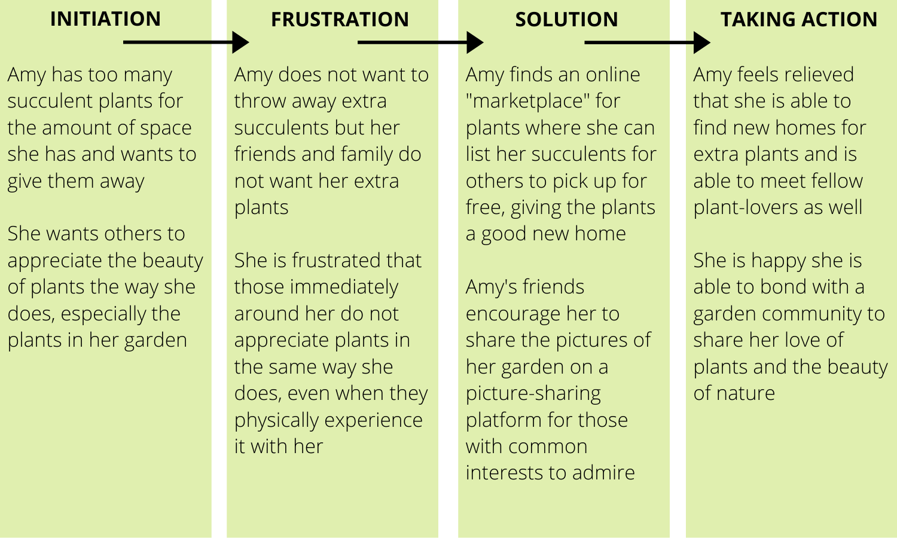
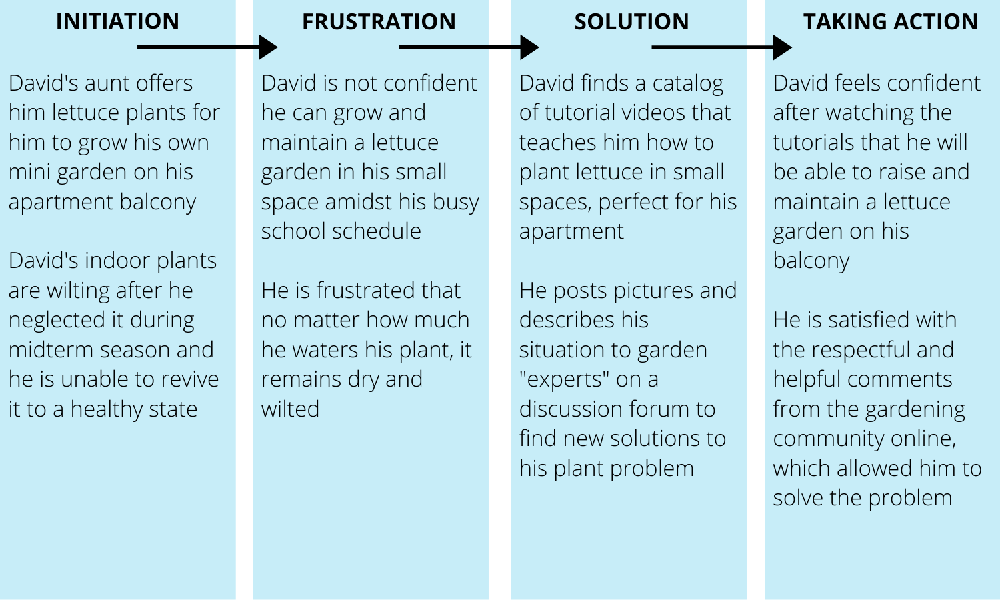

# Assignment 05 - Persona + Scenario
## Purpose of UX Storytelling
UX storytelling allows developers and designers to truly understand specific target users and their motivations in order to create a product that caters to their needs and desires. Through UX storytelling, we can grasp a better picture of the user and how they will interact with our products and designs. By starting from the users' perspective, the team can work toward satisfying these specific needs that is described in the personas and scenarios. 

## Key Features in Design
1. Catalog of informational videos about gardening

2. Interactive discussion forums for advice and "marketplace" to exchange and give plants

3. Page to display pictures of users' own plants

## Personas and Scenarios
### Persona 1 - Amy Chang
**Amy's Persona**

**Amy's Scenarios**

***Scenario 1:***

***Why?*** Amy has recently grown her succulent garden after collecting different varieties from friends and family. However, because of its easy propagation, she now has more succulents than she has space for and is saddened by the thought of throwing away perfectly healthy plants. She desperately asks her friends if they would like to take home some succulent plants, but no one offers to take any off of her hands. Determined to find a new home for these succulent plants, she resorts to offering them to strangers on the internet who can care for these plants as much as she does. 

***How?*** Amy takes pictures of her succulent plants on her smartphone and uploads to her personal computer at home. She opens a “marketplace” forum page online and uploads her pictures, listing the succulent description and her location for pick-up, in hopes that someone in her neighborhood can provide a good home for the succulents for free. After listing her succulent post, she browses the marketplace for other listings of plants she may want to exchange her succulents for. Soon after, she receives a comment on her post from a nearby gardener who is interested in taking the succulents off her hands. Amy private-messages the gardener her address and they eventually stop by her house to pick up the succulents. 

***Scenario 2:***

***Why?*** After years of experience tending to her garden, Amy appreciates the intricate beauty of nature as it grows throughout the seasons. When her rare “Queen of the Night” flower that only blooms at night finally opens, she drags her husband and children outside to appreciate it. However, her family does not seem to capture its beauty as much as she hoped. That night, she snapped a couple pictures of the rare flower and showed it to her friends the next day. Her gardening friends beamed at the picture and urged her to share its beauty to a bigger audience online.

***How?*** Using the pictures of the flower she captured on her smartphone, Amy posts them to a gardening picture-sharing platform under her profile @amylittlegarden. To post, she creates an account and is able to share all her photos under one profile, captioning every photo as she desires. Sometimes, she even includes her reflections in the form of a poem inspired by the picture. On this platform, different users are able to browse her garden photos and even follow her if they want to continue seeing her posts. They are also able to comment on her post to ask questions or give compliments. Through this, Amy is able to share the beauty of nature and connect with a bigger community with a similar appreciation for gardening.

**Amy's Journey Map**

### Persona 2 - David Peabody 
**David's Persona**

**David's Scenarios**

***Scenario 1:***

***Why?*** David is extremely interested in growing his own lettuce on his apartment balcony in order to have fresh greens for salads on hand. His aunt offers him to take some lettuce plants from her garden; however, he does not know how to plant and grow his own lettuce garden on his small balcony. Because his aunt has a large backyard garden, she is unable to advise him in his situation. David is unsure if he would be able to grow and maintain a mini garden alongside the busyness of school, so he searches up tutorial videos of growing lettuce in pots to better understand the process. 

***How?*** In his apartment, David uses his personal laptop computer to search up “lettuce-growing tutorial videos” in a search engine. The search engine brings him to a catalog of informational videos on growing lettuce. He scrolls the catalog of videos until he finds a video titled “Grow lettuce in small spaces” and clicks on it. After watching the informational video, David is more confident in growing lettuce on his apartment balcony and contacts his aunt about picking up the lettuce plants next weekend. 

***Scenario 2:***

***Why?*** Inside his apartment, David raises a few indoor plants. However, during his midterm season where he was busy studying, he neglected his plants. After his midterms were over, he finally checked on his plants only to find that one of them was drying up and wilting. After a week of watering, the plant was still wilting and losing leaves. David was unsure why this was still happening even after giving it plenty of water and could not find any useful information online. He also had no plant-experts around him that he could ask for their opinion. He then decided to reach out to a gardening community online for their expertise, even if he was shy. 

***How?*** Using his smartphone, David captured different angles to portray the condition of his indoor plant. He then uploaded his photos to a trustworthy gardening discussion forum and described his plant situation and sought advice from the online gardening community. He then surfed the discussion forum to learn more from previous posts about different types of plants and skills. After several comments, many users suggested moving his plant to a shadier area since the picture showed the plant receiving full sunlight next to a window. David was pleasantly surprised by this catered response for his plant situation and quickly followed the advice of the experts on this platform.

**David's Journey Map**

