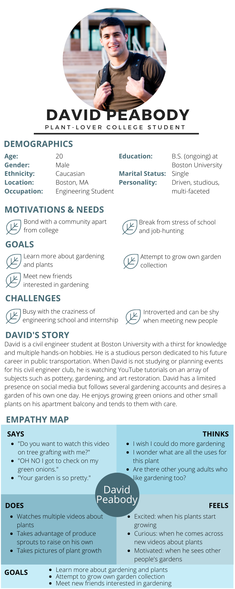

# Assignment 05 - Persona + Scenario
## Purpose of UX Storytelling
UX storytelling allows developers and designers to truly understand specific target users and their motivations in order to create a product that caters to their needs and desires. Through UX storytelling, we can grasp a better picture of the user and how they will interact with our products and designs. By starting from the users' perspective, the team can work toward satisfying these specific needs that is described in the personas and scenarios. 

## Key Features in Design
1. Catalog of informational videos about gardening

2. Interactive discussion forums for advice and "marketplace" to exchange and give plants

3. Page to display pictures of users' own plants

## Personas and Scenarios
### Persona 1 - Amy Chang
**Amy's Persona**

**Amy's Scenarios**

**Amy's Journey Map**

### Persona 2 - David Peabody 
**David's Persona**

**David's Scenarios**

**David's Journey Map**
