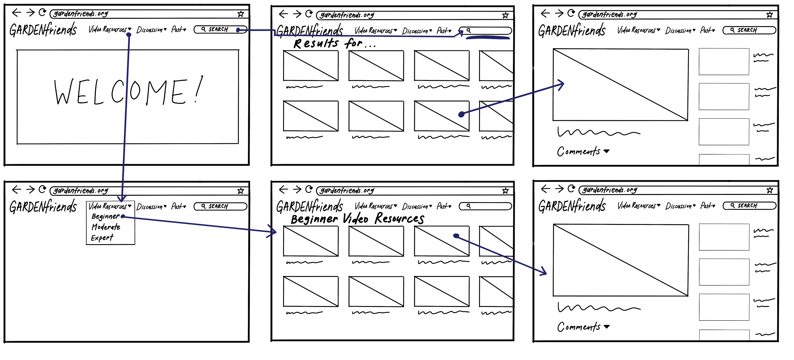

# Assignment 06 - Low Fidelity Prototype

## Project Description
This project seeks to provide informational resources and build an online community within garden-lovers of all expertise levels. The target personas are those in the garden community who wish to expand an individual love for plants online to share and learn with others. Based on user research, a resource with informational videos and an online platform to converse and share pictures with others would add value to the ways the garden community connects with each other.

The purpose of this low fidelity prototype is to test the flow and verify the functionality of the features designed for the target garden community to fulfill their needs for resources and connections.

**Features**

1. Catalog of informational videos about gardening

2. Interactive discussion forums for advice and "marketplace" to exchange and give plants

3. Page to display pictures of users' own garden

**Tasks**

1. Searching for informational garden videos 

2. Post questions and receive answers on discussion forum

3. Post pictures of your plants and receive feedback

## Wireframes and Wireflow

### Task 1: Search for garden video resources

### Task 2: Post question on discussion forum

### Task 3: Post picture of own garden

## Prototype Testing
**Task 1: Search for garden video resources**
![Wireflow1](

**Task 2: Post question on discussion forum**
![Wireflow2]

**Task 3: Post picture of own garden**
![Wireflow3](

**Notes from each task**

## Reflection
