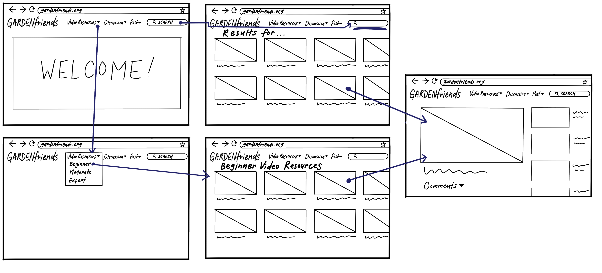
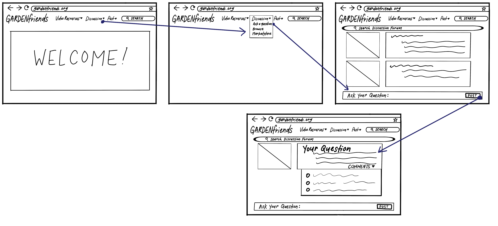
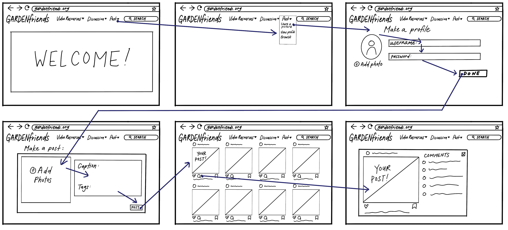
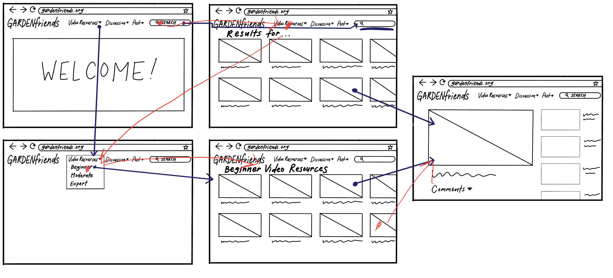
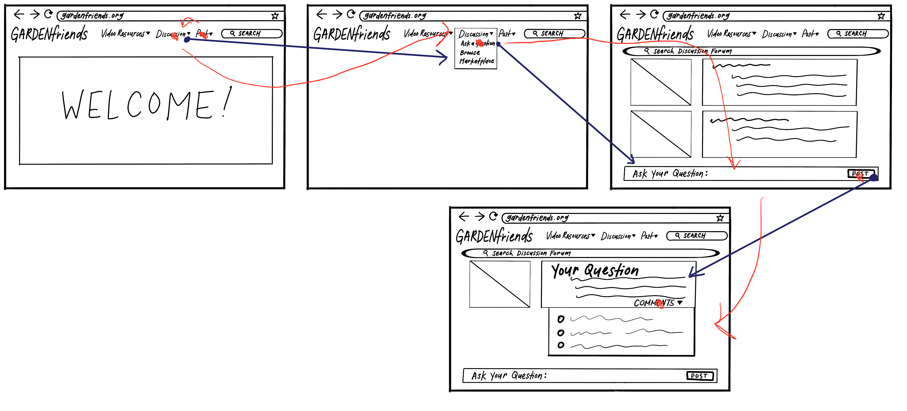
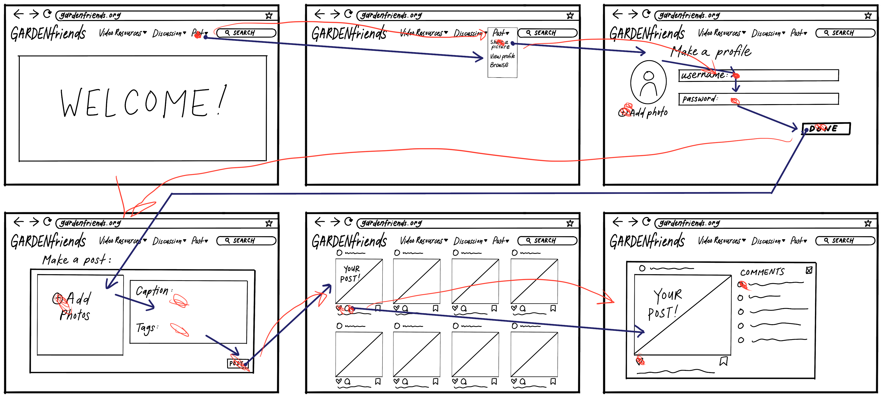

# Assignment 06 - Low Fidelity Prototype

## Project Description
This project seeks to provide informational resources and build an online community within garden-lovers of all expertise levels. The target personas are those in the garden community who wish to expand an individual love for plants online to share and learn with others. Based on user research, a resource with informational videos and an online platform to converse and share pictures with others would add value to the ways the garden community connects with each other.

The purpose of this low fidelity prototype is to test the flow and verify the functionality of the features designed for the target garden community to fulfill their needs for resources and connections.

**Features**

1. Catalog of informational videos about gardening

2. Interactive discussion forums for advice and "marketplace" to exchange and give plants

3. Page to display pictures of users' own garden

**Tasks**

1. Searching for informational garden videos 

2. Post questions and receive answers on discussion forum

3. Post pictures of your plants and receive feedback

## Wireframes and Wireflow

### Task 1: Search for garden video resources

### Task 2: Post question on discussion forum

### Task 3: Post picture of own garden

## Prototype Testing

A prototype test was conducted to better understand how the user would interact with the website design. The tester was asked to indicate clicking with a red dot and the movement of her mouse with a red arrow line. 

### Task 1: Search for garden video resources

The tester originally clicked search and after considering the task again, clicked the video resources pull down tab. This showed that the user knows there are multiple ways to complete the task (search bar or drop down menu) without confusion. This was unexpected to me since I did not think the tester would realize there were other options to find garden video resources. The task was completed relatively smoothly.

### Task 2: Post a question on a discussion forum

Because of the task given to "post a question on a discussion forum", the tester originally clicked the post drop down menu. However, when she did not find her destination, I had to direct her to the discussion drop down menu. This made me see the need to improve on the wording to differentiate the discussion forum and the photo sharing page. I would change the "Post" drop down menu to "Share" to better differentiate the two different pages and actions. After the initial confusion, the task was completed successfully.

### Task 3: Post picture of own garden

This task was completed successfully with no mishaps, even when asked to create their own profile. The user was able to follow the wireflow almost exactly as I intended. The tester also understood the functions of the like and comment button right away since it is similar to other photo sharing platforms. She automatically clicked on these interactions and engaged with those who commented on her post. She felt this test was the most straightforward.

## Reflection
