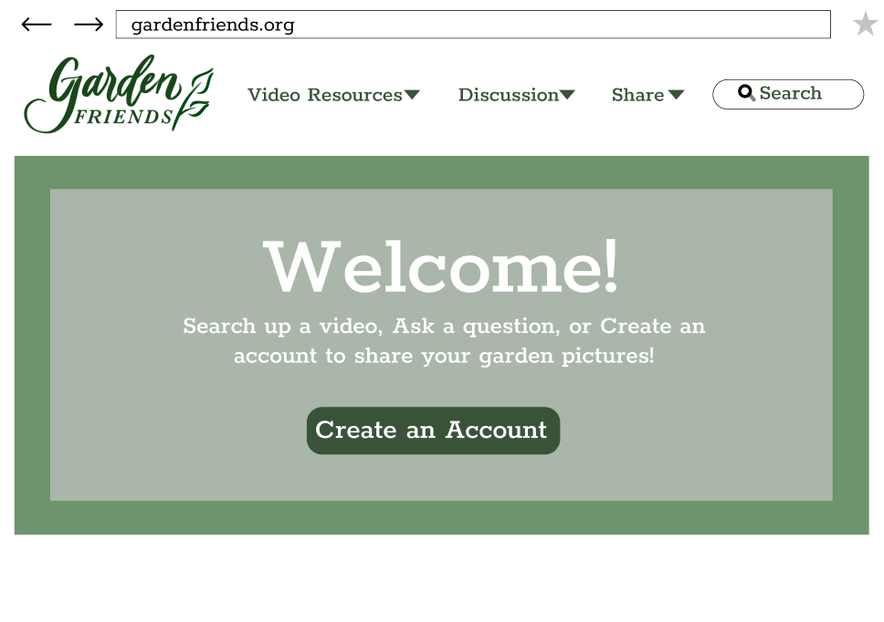

# Assignment 07-02 High-Fidelity Prototype
## Project Description
This project seeks to provide informational resources and build an online community within garden-lovers of all expertise levels. The target personas are those in the garden community who wish to expand an individual love for plants online to share and learn with others. Based on user research, a resource with informational videos and an online platform to converse and share pictures with others would add value to the ways the garden community connects with each other.

The purpose of this high fidelity prototype is to test the functionality of the features designed for the target garden community to fulfill their needs for resources and connections and polish the design to work best for the user.

**Features**

1. Catalog of informational videos about gardening

2. Interactive discussion forums for advice and "marketplace" to exchange and give plants

3. Page to display pictures of users' own garden

## Tasks
1. Searching for informational garden videos

2. Post questions and receive answers on discussion forum

3. Post pictures of your plants and receive feedback

## Wireframes / Graphic Design / First Prototype
Here are the [wireframes with graphic designs](https://www.figma.com/file/zamawKbb5AHNGsQ4hRynUZ/DH-150-A07-01-Prototype?node-id=0%3A1) made on Figma

I wanted to design a simple and inviting site with high color-contrast because older audiences should be able to easily navigate the site. I chose dark green since many gardeners tend to gravitate toward this color and it seems fitting for the topic. I also chose a white clean background to appeal to younger audiences as well and increase readability. I included straight-forward headers at the top since the various functions of the site should be presented as clearly as possible. The search bar at the top also allows users to search anything on the site if they can not find their destination from the header sections. 

## Impression Test
I showed the participant the home page which includes the most design elements that is also shown across the wireframes and collected his impressions and feedback. 

**Ethan Kim, November 22, 2020**

"Make magnifying glass smaller so it’s not touching the line"

"Logo is clean and legible"

"It's visually appealing and soothing"

"It's not clear how to connect with other gardeners"

"It needs a call to action button on first page. Maybe 'Start your own account'?"

"The color of greens are good; the darker green is good for an older audience"

"The white background is good, it's better than a beige"

"I would like to read more about what this website is about. But I think the header is really clear in terms of content!"

"Looks easy to navigate"

**Home screen wireframe before impression test**

**Home screen wireframe after adjustments from the impression test**

From the impression test, I learned that a clean and simple design is superior to a fancy, overcomplicated design for the functions and target audience of my site, since I was worried it was not "pretty" enough. I changed certain minor critiques such as making the magnifying glass smaller. I also added other major components that the participant found was necessary to include. In the home page, I included a basic description of the features of the site in order to address the point of "It's not clear how to connect with other gardeners". I also added a call to action button (Create an account) to get more users to join the online garden community the site strives to promote. Other than these changes, the participant was satisfied with the colors and aesthetics of the design.  

## Accessibility (color-contrast) Check
The dark olive text against the white background has a high (8.5) color-contrast ratio

## First Interactive Prototype 
Here is the first [interactive prototype](https://www.figma.com/proto/zamawKbb5AHNGsQ4hRynUZ/DH-150-A07-01-Prototype?node-id=2%3A0&scaling=scale-down) made on Figma

## In-class Cognitive Walkthrough 
The in-class cognitive walkthrough helped reassure me of the simplicity and effectiveness of my overall design. I was unsure if all the features available would be clear from the home screen and if the users would be able to follow the steps smoothly. Based on my classmates' input, I concluded that the features of the gardening resource and social aspects were not overshadowed and were made clear from the beginning. They also appreciated the clean design and color choices of the website. Overall, the purpose of the site and target user was understood by the participants. 

The cognitive walkthrough also revealed the easy and clear interactions of the design since it follows the structure of many other social and video platforms such as Instagram and Youtube. The participants were able to easily complete tasks through the straightforward feedback, standard templates, and large action buttons. They were also able to easily track progress when the screen changes and the results are shown upfront. 

I also gained insights to improve my prototype through the cognitive walkthrough. The participants suggested I increase interactions to make back-flow more accessible and allow the user to easily cancel their actions. One participant also stated that forward and backward buttons were not necessary for the home page. To improve aesthetics, the participants suggested adding pictures and details to more accurately portray the actual website in the prototype.

Below is the revised home screen after the cognitive walkthrough. 

## Revised Wireflow
Based on the in-class cognitive walkthrough, I included increased back-flow by allowing all screens to return to the home page when clicking on the "Garden Friends" logo at the top left of the screen. These interactions are indicated in the revised wireflow. I also added pictures for better aesthetics and more details as suggested by my classmates in the cognitive walkthrough. 
 
You can also access the [revised wireframes](https://www.figma.com/file/0qMw1ccgnRAmaf0lThz75C/DH-150-A07-02-Prototype?node-id=0%3A1) on Figma

## Final Interactive Prototype
Here is the [final interactive prototype](https://www.figma.com/proto/0qMw1ccgnRAmaf0lThz75C/DH-150-A07-02-Prototype?node-id=2%3A0&scaling=scale-down) made on Figma

## Reflection
Creating this high-fidelity interactive prototype was overall quite satisfying to see my work and research come to fruition. Creating digital wireframes on Figma showed me the detail necessary for wireframes when creating web designs. I enjoyed the process of visually presenting my ideas and features for the site. I also learned the importance of user testing and feedback, which always resulted in better understanding of how to improve my design and what users want. When creating my prototype, I constantly changed my design based on others' feedback, since I often missed certain elements in the prototype. Overall, the process was smooth and I was able to understand my target user on a deeper level. 

In my prototype, I continued to include different paths to complete the same action for different types of users. For instance, both the searchbar and video resources tab find videos or the share dropdown and the create an account button bring you to the profile page. However, if I were to change my prototype further, I would include even more options to arrive at the same destination. I would also add more details of how the discussion board operates.I would include more details and interactions in general to create a more thorough interactive high-fidelity prototype. Overall, however, I believe my prototype suffices and does a good job targeting middle-aged women with its clear and simple design.
