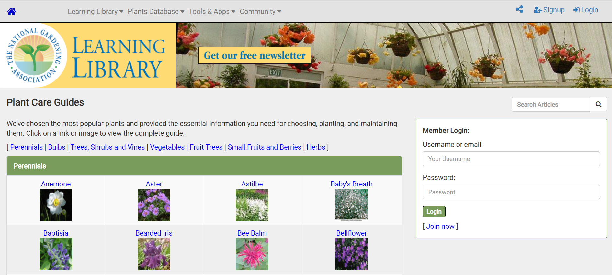
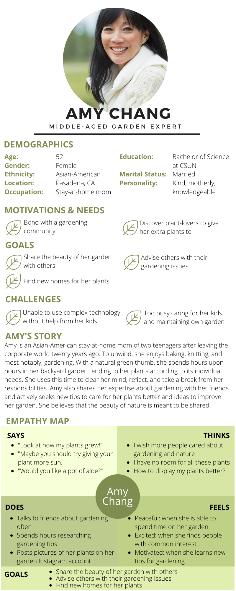
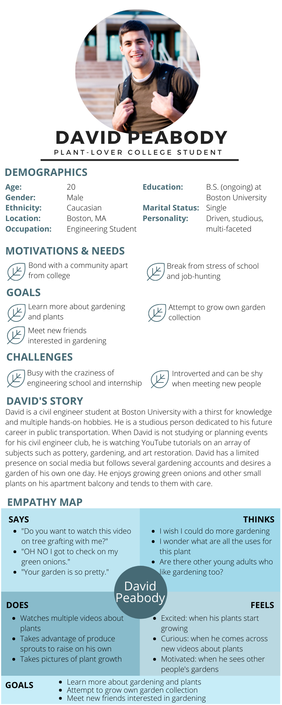
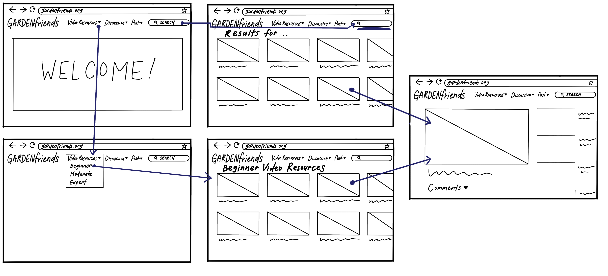
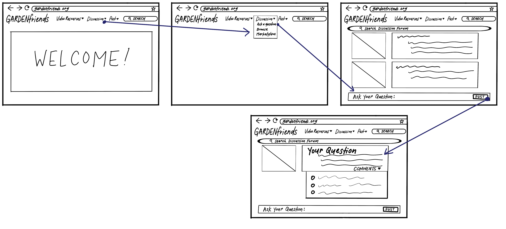
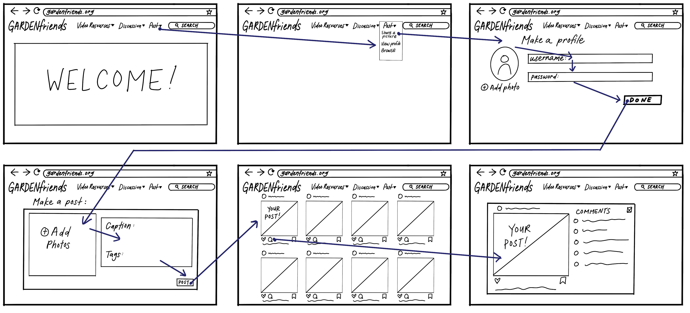

# Garden Social Site 
#### DH150: UX+UI, by Jessika Wang

## Introduction 
*Gardenfriends.org* seeks to provide informational resources and build an online community within garden-lovers of all expertise levels. The target personas are those in the garden community who wish to expand an individual love for plants online to share and learn with others. Based on user research, a resource with informational videos and an online platform to converse and share pictures with others would add value to the ways the garden community connect with each other.

## Design Statement
My project hopes to support middle-aged women with a community that understands their hobbies and helps them grow as people, especially during a time of isolation. For many people, gardening is a form of therapy that gives them a sense of serenity when spending time with their plants. Through the understanding of these motivations, we can further advance the therapeutic aspects of gardening, while providing a bond over the love of plants. The project also hopes to enable gardeners to share their proudest plant collections and help one another become better gardeners. Though there are resources about gardening found online and opportunities to join planting communities, I want to mesh the two successfully online, after understanding the user and their motivations behind their love for gardening.

## Competitor analysis: Heuristic Evaluation
During this time of isolation, gardeners are finding it more difficult to interact with their community of same-minded individuals. As of now, online gardening platforms focus primarily on resources and provide limited opportunities and services to connect with other gardeners. Through this heuristic evaluation, I evaluated the features and design of gardening resource websites in order to create a unique experience that encourages community and learning for all levels of gardeners. 

Garden.org is a website that provides both beginner and avid gardners with resources to connect with one another and gather useful gardening tips. There are many articles and useful information available about all different kinds of plants.

View the full heuristic evaluation [here](https://github.com/jessikarwang/DH150-JessikaWang/blob/main/README.md)

## Competitor analysis: Usability Testing
Through usability testing, we aim to improve the website from the users' perspective. UT allows developers to understand and improve their site/app to achieve a certain goal that is user-driven. Through this usability test, I want to test how the aesthetic and the search engine affects the user's ability to research information in different scenarios. Each task will ask the users to utilize the search bar in order to conduct research related to gardening and test the user's ability to navigate the website. Ultimately, we are trying to understand the user and their perspective of the website's functions.

<figure class="Garden_UT">
 <iframe src="https://drive.google.com/file/d/1Y5_8U7R4U23vfMOHOFhVG_J-dktOIfNb/preview" width="640" height="480"></iframe>
</figure>

View the full usability testing [here](https://github.com/jessikarwang/DH150-JessikaWang/tree/main/assignment02)

## User research: Contextual Inquiry
In order to better understand users and their motivations, I conducted a contextual inquiry on my roommate who enjoys gardening and learning about plants. The methods I used were interview and participatory observation. This was conducted in the apartment in a quiet environment. 

The session included the following sections:

**1. Background Questions** I wanted to learn about the user's decision-making reasoning around their major and hobbies. I also wanted to learn more about their initial ideas around hobby-centered communities. I also want to know the user's typical day to support their lifestyle and needs.

**2. Observations** First, I asked the user to search up any topic on their preferred website and walk me through their thought process. I asked questions throughout the task to learn more about their reasoning. I also asked whether they felt a community online forum was reliable. Next, I asked the user to search for gardening related topics and asked more in depth about their experiences of an online gardening community. I also asked what they are looking for when searching topics and their thoughts on sharing their own gardening experiences online.

**3. Follow-up Questions** I asked direct follow-up questions to find other sources of an online gardening reasource and community. I also asked about their ideas for an online garden community. 

View the full the contextual inquiry [here](https://github.com/jessikarwang/DH150-JessikaWang/blob/main/assignment04/README.md)

## UX storytelling
UX storytelling allows developers and designers to truly understand specific target users and their motivations in order to create a product that caters to their needs and desires. Through UX storytelling, we can grasp a better picture of the user and how they will interact with our products and designs. By starting from the users' perspective, the team can work toward satisfying these specific needs that is described in the personas and scenarios.

**Key Features in Design**

1. Catalog of informational videos about gardening

2. Interactive discussion forums for advice and "marketplace" to exchange and give plants

3. Page to display pictures of users' own plants

 | 

View the full personas and scenarios [here](https://github.com/jessikarwang/DH150-JessikaWang/blob/main/Assignment05/README.md)

## Low-fidelity prototype 
The purpose of this low fidelity prototype is to test the flow and verify the functionality of the features designed for the target garden community to fulfill their needs for resources and connections.

**Tasks**
1. Searching for informational garden videos

2. Post questions and receive answers on discussion forum

3. Post pictures of your plants and receive feedback

Read more and view the wireflows [here](https://github.com/jessikarwang/DH150-JessikaWang/blob/main/Assignment06/README.md)

## Wireframe and graphic design element variation 
Here below is both the low-fidelity and high-fidelity wireflows reflecting all three scenarios and tasks 

 |  | 

Access the [wireframes](https://www.figma.com/file/0qMw1ccgnRAmaf0lThz75C/DH-150-A07-02-Prototype?node-id=0%3A1) on Figma too

## High-fidelity prototype 
The purpose of this high fidelity prototype is to test the functionality of the features designed for the target garden community to fulfill their needs for resources and connections and polish the design to work best for the user.

<figure class="video_container">
 <iframe style="border: 1px solid rgba(0, 0, 0, 0.1);" width="800" height="450" src="https://www.figma.com/embed?embed_host=share&url=https%3A%2F%2Fwww.figma.com%2Fproto%2F0qMw1ccgnRAmaf0lThz75C%2FDH-150-A07-02-Prototype%3Fnode-id%3D2%253A0%26scaling%3Dscale-down" allowfullscreen></iframe>
</figure>

Access the [final interactive prototype](https://www.figma.com/proto/0qMw1ccgnRAmaf0lThz75C/DH-150-A07-02-Prototype?node-id=2%3A0&scaling=scale-down) on Figma too

## Optional evaluation and revision history 
View full cognitive walkthrough, impression test, and revision history [here](https://github.com/jessikarwang/DH150-JessikaWang/blob/main/Assignment07-02/README.md)

## Pitch video 

## Conclusion 
Creating this high-fidelity interactive prototype was overall quite satisfying to see my work and research come to fruition. Creating digital wireframes on Figma showed me the detail necessary for wireframes when creating web designs. I enjoyed the process of visually presenting my ideas and features for the site. I also learned the importance of user testing and feedback, which always resulted in better understanding of how to improve my design and what users want. When creating my prototype, I constantly changed my design based on others' feedback, since I often missed certain elements in the prototype. Both the impression test and cognitive walkthrough was necessary for me to improve and gain confidence in my design. Overall, the process was smooth and I was able to understand my target user on a deeper level.

In my prototype, I continued to include different paths to complete the same action for different types of users. For instance, both the searchbar and video resources tab find videos or the share dropdown and the create an account button bring you to the profile page. However, if I were to change my prototype further, I would include even more options to arrive at the same destination. Moreover, I would add more details of how the discussion board operates. In general, I should include more details and interactions to create a more thorough interactive high-fidelity prototype. Overall, however, I believe my prototype suffices and does a good job targeting middle-aged women with its clear and simple design.
