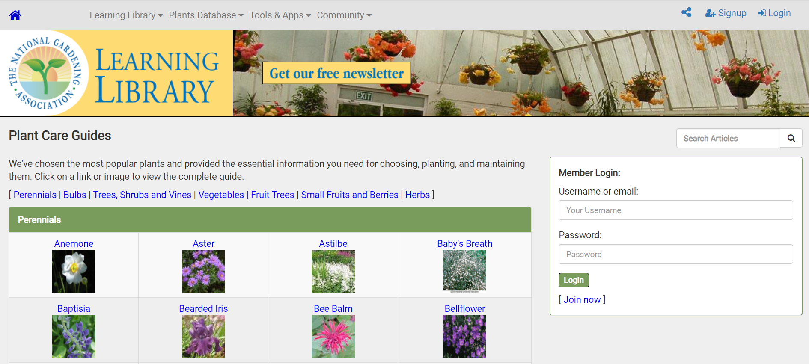

# DH150-JessikaWang
## Assignment 1 Heuristic Evaluation

## Resources for Mom
I chose to base my project off my mom, who is a middle-aged woman. She is someone with many hobbies and have been recently introduced to the many resources found on the internet. I want to find good sites that many middle-aged women can easily navigate without help from their children. I chose a gardening resource website because I can see my mom searching up gardening tips when working on her own garden. 

## The National Gardening Association
https://garden.org/learn/library/plantguide/
*The National Gardening Association is a resource that provides information and useful tips on gardening and plants. They maintain a large database of plants to conduct research and also created a network so plant lovers can connect and converse with one another. Here, visitors can search for resources regarding all things gardening.*

# Overall Evaluation
*hello*

# Heuristic Evalution
*Severity Rating (1-3)
1: Cosmetic Problem, low priority
2. Minor problem
3. Top priority*

**1. Visibility of system status**: informing users of the status of the page through feedback

*Severity Rating: 3- Top Priority* 

**2. Match between system and the real world**: use logical words and icons that match common sense of the user

**3. User Control and Freedom**: Give users options

**4. Consistency and Standards**: Use conventional words across the board

**5. Error prevention**: safety nets to prevent errors

**6. Recognition rather than recall**: Make options visible so the user does not need to remember everything

**7. Flexibility and efficiency of use**: Make the options available to use by all levels 

**8. Aesthetic and minimalist design**: Only include important information and a minimal design

**9. Help users recognize, diagnose, and recover from errors**: error messages should be easy to understand and provide easy solutions

**10. Help and documentation**: Provide easy accessible help information for the user

## Other Website

# Overall Evalution

# Heuristic Evalution
*Severity Rating (1-3)
1: Cosmetic Problem, low priority
2. Minor problem
3. Top priority*

**1. Visibility of system status**: informing users of the status of the page through feedback

*Severity Rating: 3- Top Priority* 

**2. Match between system and the real world**: use logical words and icons that match common sense of the user

**3. User Control and Freedom**: Give users options

**4. Consistency and Standards**: Use conventional words across the board

**5. Error prevention**: safety nets to prevent errors

**6. Recognition rather than recall**: Make options visible so the user does not need to remember everything

**7. Flexibility and efficiency of use**: Make the options available to use by all levels 

**8. Aesthetic and minimalist design**: Only include important information and a minimal design

**9. Help users recognize, diagnose, and recover from errors**: error messages should be easy to understand and provide easy solutions

**10. Help and documentation**: Provide easy accessible help information for the user

