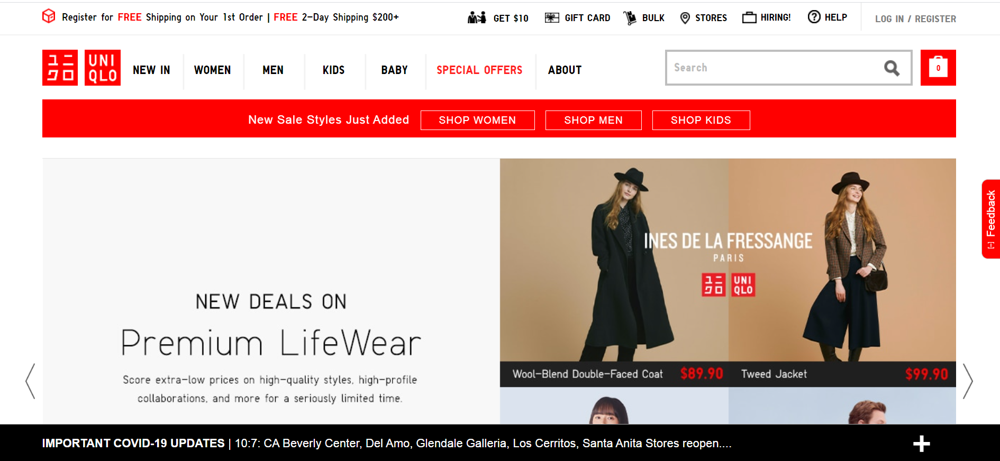

# DH150-JessikaWang
## Assignment 1 Heuristic Evaluation

## Resources for Mom
I chose to base my project off my mom, who is a middle-aged woman. She is someone with many hobbies and have been recently introduced to the many resources found on the internet. I want to find good sites that many middle-aged women can easily navigate without help from their children. I chose a gardening resource website because I can see my mom searching up gardening tips when working on her own garden. My mom also enjoys shopping for clothes to find outfits that are flattering and also age-appropriate. Although she prefers shopping in person, because of COVID, she is forced to shop online like many of us. Therefore I chose the Uniqlo shopping website, an online store that middle-aged women frequent often. 

# The National Gardening Association
https://garden.org/learn/library/plantguide/
*The National Gardening Association is a resource that provides information and useful tips on gardening and plants. They maintain a large database of plants to conduct research and also created a network so plant lovers can connect and converse with one another. Here, visitors can search for resources regarding all things gardening.*

## Overall Evaluation
*This website clearly has many useful resources for both beginner and advanced gardeners. However, the aesthetic and presentation of the information is lacking and the improvement of this would increase traffic and usability. The website is generally easy to navigate; however middle-aged women might have more difficulty because of the clutter and disorganization of the site and search bars.*

## Heuristic Evalution
*Severity Rating (1-3)
1: Cosmetic Problem, low priority
2: Minor problem
3: Top priority*

**1. Visibility of system status**: informing users of the status of the page through feedback

*Good*: The bold sub-titles always indicates what page the user is on
*Bad*: There is no other indication of the status of the page. In general the page is quite flat and non-engaging in its system status.
  We could instead include loading circles and create a more noticeable page location bar
*Severity Rating: 2- Minor Priority* 

**2. Match between system and the real world**: use logical words and icons that match common sense of the user

*Good*: The home icon is an easy to understand icon that even middle-aged women can comprehend. This icon will take you to the home page. The other icons of the search bar, login, signup, and share are all logical icons that match the real world of today. 

**3. User Control and Freedom**: Give users options, especially during a mistake

*Bad*: There is no way to go back to the previous page without clicking it again if a mistake was made. There is no undo or redo.
  We could instead include a back and forward button near the home icon.
*Severity Rating: 2- Minor Priority* 

**4. Consistency and Standards**: Use conventional words across the board

*Good*: In general, the website is easy for beginner gardeners to understand, especially if needing small gardening tips. The "community" aspect is also effectly conveyed in the website and purpose of the association. 

**5. Error prevention**: safety nets to prevent errors

*Good*: Before sharing the page, an extra pop-up occurs to confirm if you want to share the page on social media.

**6. Recognition rather than recall**: Make options visible so the user does not need to remember everything

*Bad*: The options are extremely confusing and condensed and are visible only after clicking all the drop down menus. 
  We could instead show what sub-section the user has clicked on at the top of each page.
*Severity Rating: 3- Top Priority* 

**7. Flexibility and efficiency of use**: Make the options available to use by all levels 

*Good*: Both simple actions and more complex interactions with the site is supported. Some people do not need to interact with the community and simply want to look up resources for gardening. 

**8. Aesthetic and minimalist design**: Only include important information and a minimal design

*Bad*: The aesthetic is quite drab and extremely cluttered
  We could spread out the information and create a single column rather than 2 columns on the home page. Though the aesthetics aren't most important, the design of the page extremely hinders all other aspects that it can provide.
*Severity Rating: 3- Top Priority* 

**9. Help users recognize, diagnose, and recover from errors**: error messages should be easy to understand and provide easy solutions

*Bad*: Few errors pop up but when you search for a keyword that is not found, they do not tell you but recommend different articles and resources
  We could instead include an error message when a keyword was not found and give other suggestions based off the keyword
*Severity Rating: 2- Minor Priority* 

**10. Help and documentation**: Provide easy accessible help information for the user

*Bad*: There is just a flood of information on the website with no useful concise help and documentation that would help condense the information.
  Provide instead a FAQ page or help center on the page.
*Severity Rating: 3- Top Priority* 

# Uniqlo
https://www.uniqlo.com/us/en/home/
*Uniqlo is an Asian clothing brand that sells more expensive, high quality, everyday wear, perfect for an older women with stable income and financial situation. The company values new and lightweight technology when creating their clothes, and they advertise this on their website. The website allows shoppers to easily find clothes suitable to their taste and eventually can shop in stores or purchase online.*

## Overall Evalution
*The website is consistent with their stores' and brands' aesthetic on their website through the simple text and small pops of red around the site. The usability of the site as a whole is quite comprehensive, and even middle-aged women who would like to shop online can easily navigate the site. The amount of options and navigation of the subsections is extremely helpful and allows users to feel like they have control. I think the site does a good job allowing users to feel comfortable and excited to explore more about the company and their products.*

## Heuristic Evalution
*Severity Rating (1-3)
1: Cosmetic Problem, low priority
2. Minor problem
3. Top priority*

**1. Visibility of system status**: informing users of the status of the page through feedback

*Good*: The tabs between WOMEN/MEN/KIDS/ETC. highlight red when you are visiting that subsection of shopping on the site. This is also apparent in other clickable words throughout the website.
*Bad*: There is no other indication of the status of the page after clicking on a page.
  We could instead include loading circles 
*Severity Rating: 1- low Priority* 

**2. Match between system and the real world**: use logical words and icons that match common sense of the user

*Good*: The icons and keywords at the very top of the page (Stores, Gift Card, etc.) are all common words and icons that match the real world that are easily understandable by middle-aged women. 

**3. User Control and Freedom**: Give users options

*Good*: After clicking a large sub-tab, there are many options to choose from on the left side of the page to help navigating the online shop easier. There is also an indication of all the places you visited first at the top and you can click the words to go back. For example: Home>Womens>New Arrivals

**4. Consistency and Standards**: Use conventional words across the board

*Good*: The site uses standard language that is understandable to everyone, including middle aged women. They call your cart your "shopping bag" because in stores, shoppers put items into their bag, not a cart. 

**5. Error prevention**: safety nets to prevent errors

*Bad*: There is little safety prevention in case of mistakes. The site will automatically take you to the next page without asking if you wanted to switch tabs or not.
  Before navigating to their social medias, we should ask before taking the viewer to a completely new site.
*Severity Rating: 2- minor problem* 

**6. Recognition rather than recall**: Make options visible so the user does not need to remember everything

*Good*: All the options are extremely visible on the side bar and drop down menu. They are also given an indication of what page they are currently visiting every time. 

**7. Flexibility and efficiency of use**: Make the options available to use by all levels 

*Good*: All levels can understand the use of the design and site. People like middle-aged women who are less familiar with online shopping can easily navigate it as well as younger generations who constantly shop online.

**8. Aesthetic and minimalist design**: Only include important information and a minimal design

*Good*: The aesthetic is striking! The white background is extremely clean and gives a good contrast to the colorful photos and the pops of red around the site.
*Bad*: The home page is originally a little cluttered and the black bar at the bottom is distracting and ugly.
  We could spread out the information lower down on the home page, especiall if the information is not the first thing viewers want to see. 
*Severity Rating: 1- low priority* 

**9. Help users recognize, diagnose, and recover from errors**: error messages should be easy to understand and provide easy solutions

*Good*: If searching for a keyword that doesn't exist, the site with notify you that no keyword can be found. They then will suggest you to similar items based off the keyword

**10. Help and documentation**: Provide easy accessible help information for the user

*Good*: You can easily find the help page at the top AND bottom of the page! 
